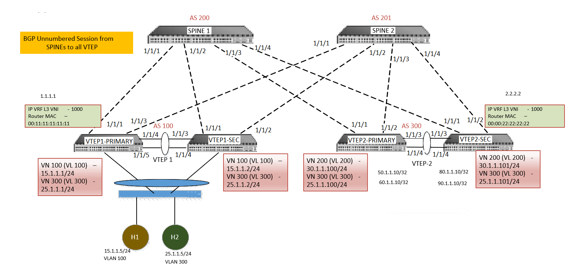

# Dell EMC Networking OS10 Ansible Automation for VxLAN Symmetric IRB, Unnumbered BGP and Type-5 Routes Leaf & Spine CLOS fabric
================================================================================================================================
This example shows configuration for 2 sites with VxLAN Symmetric IRB, Unnumbered BGP and Type-5 Routes Leaf & Spine model
* Anycast gateway is configured for default gateway redundancy for virtual network 
* Ansible is used for configuration management and automation
* Some Dell EMC Networking Ansible Roles was modified to support Symmetric IRB with Type-5 Routes and unnumbered BGP configuration. 
* The sample topology is given in the Network Topology.

## Network Topology

